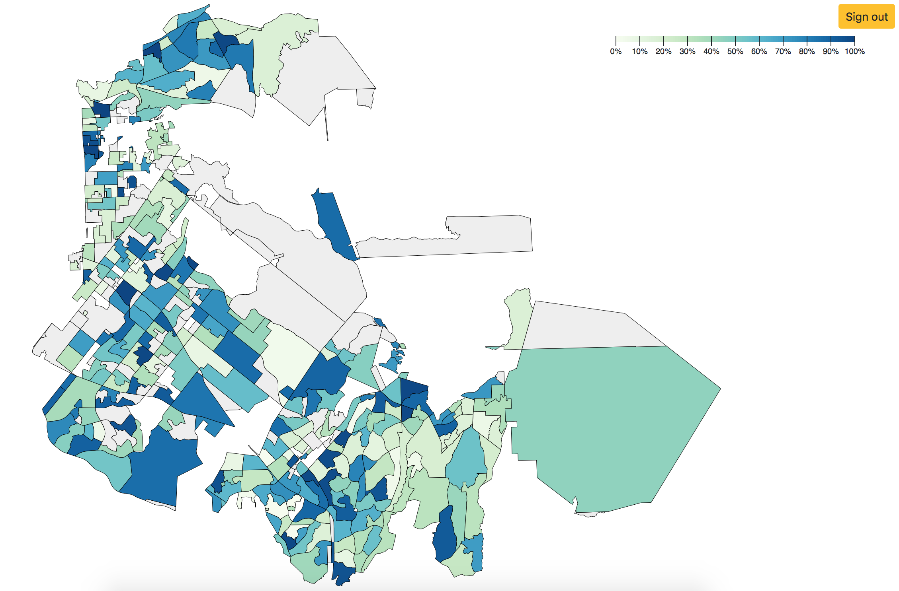

# Turf tracker map

Draw a map geo data (from TopoJSON URL, TopJoSON document on Google Drive, or GeoJSON document on Google Drive)
plus fill color data (from Google Sheet)

Use Google Drive and Sheets permissions to limit access.

http://turf-tracker-map.s3.amazonaws.com/index.html

Make your own: you'll need geo data and a Google Sheet with values for the geo data features.

## prep geo data

### get GeoJSON data

    curl https://www.ocvote.com/maps/data/?file=precincts.js > data/oc-precincts.json

### filter data (if needed)

#### sample map shows only CA-45

get all OC districts

    curl https://www.ocvote.com/maps/bin/get.php?type=results-map&election=pri2018&contest=UNITED%20STATES%20REPRESENTATIVE%2045th%20District& > oc-45-results.json

filter GeoJSON to include only precincts in sheet

    python filter_geojson.py > precincts.json

### convert to [TopoJSON](https://github.com/topojson/topojson)

use http://mapshaper.org/ or [mapshaper command line](https://github.com/mbloch/mapshaper)
to convert to TopoJSON and simplify to reduce file size. Export to *key*.json.

## prep color data

create Google sheet with these columns:
  - `id` must match a unique feature identifier in the geo data (_feature_.`geometry.properties.`_uniqueIdentifier_)
  - `value` number or category (ie 1-100 for precentage or Group1|Group2|Group3)
  - `label` label for tooltip (optional; use `id` if not specified)

## create config

Add a new config key to `CONFIG` in [config.js](config.js)

If geo data is public:
  - upload to a public URL; set a long cache time
  - set `topoURL` param to the URL

If geo data is private:
  - upload to Google Drive
  - set `topoDocId` param to the file's id

Set `topoObjects` to the key under `objects` in the topoJSON file (ie `precincts` for [data/ca-45.json](data/ca-45.json))

Set `featureKey` to the key for the unique feature identifier in the geo data (ie `PRECINCT` for [data/ca-45.json](data/ca-45.json) )

Set `sheetId` to the id of the fill color Google Sheet (from the URL)
create config key with these key/value pairs:

Set `sheetRange` range containing `id, value, label` fields

Set `scaleType` to `numeric` for numeric values, `ordinal` for categorical values

Set `projection` to a [d3 projection object](https://github.com/d3/d3-geo-projection) that converts geo data to document coordinates

  - for California data, use default [California Albers](https://bl.ocks.org/mbostock/5562380)
  - if data is already projected (coordinates in TopoJSON are not lat/lng pairs), use `d3.geoIdentity`
  - if map appears upside down, add `.reflectY(true)`
